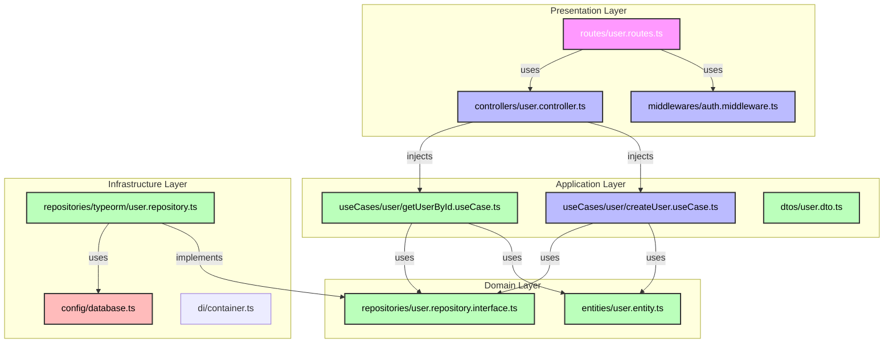

```mermaid
graph TD
    subgraph "Presentation Layer"
        A[routes/user.routes.ts]
        B[middlewares/auth.middleware.ts]
        C[controllers/user.controller.ts]
    end
    
    subgraph "Application Layer"
        D[useCases/user/createUser.useCase.ts]
        E[useCases/user/getUserById.useCase.ts]
        F[dtos/user.dto.ts]
    end
    
    subgraph "Domain Layer"
        G[entities/user.entity.ts]
        H[repositories/user.repository.interface.ts]
    end
    
    subgraph "Infrastructure Layer"
        I[repositories/typeorm/user.repository.ts]
        J[config/database.ts]
        K[di/container.ts]
    end

    A -->|uses| B
    A -->|uses| C
    C -->|injects| D
    C -->|injects| E
    D -->|uses| G
    E -->|uses| G
    D -->|uses| H
    E -->|uses| H
    I -->|implements| H
    I -->|uses| J
    
    style A fill:#f9f,stroke:#333,stroke-width:2px,color:#ffffff
    style B fill:#bbf,stroke:#333,stroke-width:2px,color:#000000
    style C fill:#bbf,stroke:#333,stroke-width:2px,color:#000000
    style D fill:#bbf,stroke:#333,stroke-width:2px,color:#000000
    style E fill:#bfb,stroke:#333,stroke-width:2px,color:#000000
    style F fill:#bfb,stroke:#333,stroke-width:2px,color:#000000
    style G fill:#bfb,stroke:#333,stroke-width:2px,color:#000000
    style H fill:#bfb,stroke:#333,stroke-width:2px,color:#000000
    style I fill:#bfb,stroke:#333,stroke-width:2px,color:#000000
    style J fill:#fbb,stroke:#333,stroke-width:2px,color:#000000

```